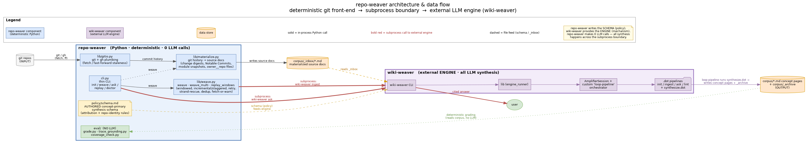
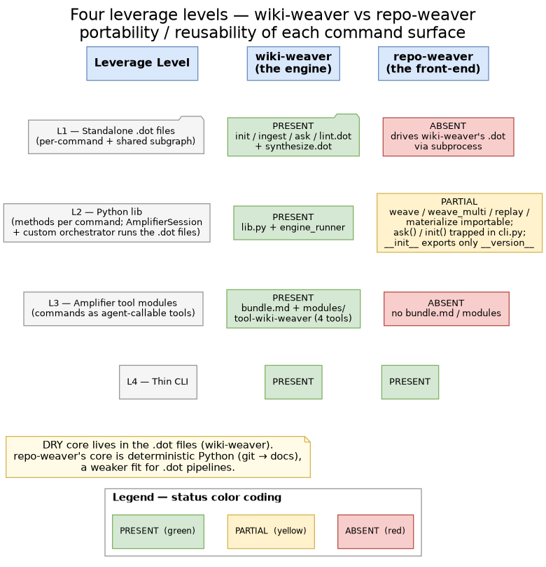

# repo-weaver Architecture

> Audience: a developer new to repo-weaver. Read this first.

## 1. What repo-weaver is

repo-weaver is a **deterministic, git-aware front-end** that turns a collection of
git repositories (commits + merged PRs) into a queryable, cited knowledge wiki.

It does **not** do the wiki synthesis itself. It **shells out** to the external
`wiki-weaver` engine, which performs all the LLM work. **repo-weaver makes ZERO
direct LLM / model API calls** — it is deterministic plumbing plus an authored schema.

## 2. The boundary: wiki-weaver vs repo-weaver

| | wiki-weaver | repo-weaver |
|---|---|---|
| Role | Generic LLM wiki-synthesis **engine** (mechanism) | Git-aware **front-end** (policy / content) |
| Input | A folder of source docs + a `policy/schema.md` | Git repos (commits + merged PRs) |
| Does | Ingests, reconciles, cites, weaves concept pages, answers queries | Adapts git → source docs, orchestrates weaves, grades output |
| Knows about git? | No — domain-agnostic | Yes — this is its whole job |

repo-weaver **never imports** wiki-weaver (`dependencies = []`). The boundary is a
process boundary, crossed only via subprocess:

- Every synthesis is `subprocess.run(["wiki-weaver", "ingest", ...])` — `weave.py:~533`
- Every query is `subprocess.run(["wiki-weaver", "ask", ...])` — `cli.py:~284`



## 3. Layers / modules

repo-weaver adds ~3,100 LOC (package) + ~1,350 LOC (eval) on top of the engine.

### `repo_weaver/materialize.py` + `gitio.py` (~1,500 LOC) — the git → source-docs adapter

Per window, per repo it emits:

- A `<owner>__<repo>-<until>-changes.md` **change digest** — merged-PR sections, a
  **"Notable Commits"** section for commit-only repos, and a commit-volume summary.
- Optional `module-<owner>__<repo>-<slug>-<until>.md` **module snapshots**.

Org-scoped `owner__repo` filename qualifiers prevent same-basename collisions.
Never fabricates provenance — all data comes from git / gh plumbing.

### `repo_weaver/policy/schema.md` — the authored synthesis schema

repo-weaver's **content/policy** fed into wiki-weaver's externalized-schema **mechanism**:

- Concept-primary pages with `repos:` attribution frontmatter.
- Repo-identity rules: same-name ≠ same-repo; no inferred rename without cited lineage;
  fail loud on ambiguity.
- Per-repo index/overview grouping; append-only `log` page.

### `repo_weaver/weave.py` + `cli.py` (~1,600 LOC) — weave orchestration

Multi-repo, windowed, incremental/staggered weave orchestration: raised digest cycle
budget, retry with backoff, strand-rescue when the engine crashes mid-run, archive-skip
dedup, fetch-or-warn staleness check.

### `eval/` (~1,350 LOC) — deterministic eval harness

- `grade.py` — ontology / weave metrics.
- `trace_grounding.py` — groundedness tracer (string/version/quote normalization, **no LLM**).
- `coverage_check.py` — coverage metrics.
- `run_questions.py` — shells out to `repo-weaver ask`.
- Question sets.

## 4. Data flow

```
git repos
  → gitio (git / gh)
  → materialize (source docs)
  → corpus/_inbox/*.md
  → wiki-weaver ingest   (loop-pipeline orchestrator runs synthesize.dot
                          using repo-weaver's policy/schema.md)
  → concept pages + _archive
  → wiki-weaver ask
  → cited answers

eval/ grades the corpus deterministically (out of band).
```

## 5. Why no LLM calls here

All synthesis and query LLM work is delegated to the wiki-weaver subprocess.
repo-weaver stays deterministic plumbing + an authored schema. Benefits:

- **Cheap & fast** — no model API cost on the repo-weaver side.
- **Unit-testable** — deterministic output is gradeable and diffable.
- **Free improvement** — the engine improves underneath repo-weaver for free.

## 6. Portability — the four leverage levels

wiki-weaver offers four leverage levels: standalone `.dot` files, a Python library,
Amplifier tool modules, and a thin CLI. repo-weaver's current state:

| Level | Form | Status |
|---|---|---|
| **L4** | Thin CLI | ✅ |
| **L2** | Python library | ◐ partial — `weave()` / `weave_multi()` / `replay_windows()` / `materialize()` are importable, but `__init__.py` exports only `__version__`, and `ask()` / `init()` logic still lives in `cli.py` |
| **L1** | Standalone `.dot` files | ✗ — repo-weaver drives wiki-weaver's `.dot` via subprocess |
| **L3** | Amplifier tool modules | ✗ — no `bundle.md` / `modules/` |



### Roadmap

1. **(highest value)** Add `bundle.md` + `modules/tool-repo-weaver` to expose commands
   as agent-callable tools.
2. Finish the lib surface — curate `__init__.py`, extract `ask()` / `init()` out of `cli.py`.
3. `.dot` pipelines are a **weaker fit**: repo-weaver's core is deterministic git plumbing,
   not LLM logic (which is what `.dot` attractor pipelines are for). Pursue only when an
   attractor-harness consumer (e.g. Amplifier Resolve's dot-graph resolver) is concretely needed.

## 7. The five fixes shipped (2026-06-23/24)

All on repo-weaver's side of the boundary — **the engine was untouched**.

1. **Commit-detail "Notable Commits"** — coverage for commit-only repos.
2. **Org-scoped `owner__repo` qualifier** — fixes same-name collision / overwrite.
3. **Incremental-weave qualifier** — fixes one-at-a-time weave collisions.
4. **Repo-identity rules** — same-name ≠ same-repo.
5. **Eval tracer version-normalize + trailer-strip** — groundedness tracing accuracy.
